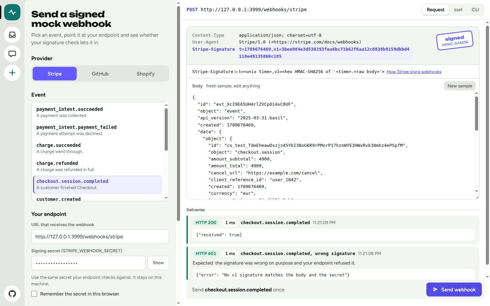

<h1 align="center">Webhook Mock Sender</h1>

<p align="center">
  A CLI and a local web form that send fake Stripe, GitHub and Shopify webhook events to your endpoint —
  signed exactly the way the provider signs them, so your signature check passes.
</p>

<p align="center">
  <a href="https://webhooker.eu/">webhooker.eu</a> ·
  <a href="#quick-start">Quick start</a> ·
  <a href="#cli">CLI</a> ·
  <a href="#web-form">Web form</a> ·
  <a href="#how-each-provider-signs-webhooks">Signatures</a> ·
  <a href="https://github.com/webhooker-eu">More tools</a>
</p>

<p align="center">
  <a href="https://webhooker.eu/"></a>
  
  
  
  
  
</p>

<p align="center">
  
</p>

---

## What is Webhook Mock Sender?

Webhook Mock Sender is a free, open-source tool by [Webhooker](https://webhooker.eu/) for testing a
webhook endpoint without touching the real provider. It builds a realistic Stripe, GitHub or Shopify
event, signs it with your webhook secret using the provider's own scheme, and POSTs it to any URL —
`localhost` included. No account, no tunnel, no test-mode dashboard.

It also sends the requests a provider never will on demand: a wrong signature, a replayed old
request, a duplicate delivery. That is how you check that your handler refuses what it should.

Everything runs on your own machine, so the signing secret never goes to a third-party website.

### Features

| Feature | Description |
|---|---|
| **Valid signatures** | `Stripe-Signature`, `X-Hub-Signature-256` and `X-Shopify-Hmac-Sha256` computed over the exact bytes that are sent. The Stripe signature is tested against the official `stripe` library. |
| **28 event templates** | Payments, subscriptions and invoices for Stripe; push, pull requests, issues and releases for GitHub; orders, products and customers for Shopify. Fresh IDs and timestamps on every run. |
| **Provider headers** | `X-GitHub-Event`, `X-GitHub-Delivery`, `X-Shopify-Topic`, `X-Shopify-Webhook-Id`, the provider's `User-Agent` and the rest. |
| **Failure scenarios** | `--invalid-signature`, `--timestamp-offset -600` (a replay) and `--repeat 2` (a duplicate delivery), with `--expect 401` to assert the answer in CI. |
| **Editable payloads** | Change one field with `--set data.object.amount=5000`, or sign and send your own JSON with `--payload-file`. |
| **Web form** | Pick an event, edit the body, watch the signed headers update, send, and read what your endpoint answered. |
| **Export** | Print the signed request, or get it as a `curl` command. |
| **Readable results** | Status, response body, timing, and a hint for the usual mistakes: parsed body instead of raw body, redirects, Docker's `localhost`. |
| **Script friendly** | `--json` output, meaningful exit codes, secrets from environment variables. |

## Quick start

Run it without installing, using [uv](https://docs.astral.sh/uv/):

```bash
export STRIPE_WEBHOOK_SECRET='whsec_...'   # the secret your endpoint verifies against

uvx --from git+https://github.com/webhooker-eu/webhook-mock-sender \
  webhook-mock-sender send stripe payment_intent.succeeded http://localhost:3000/webhooks/stripe
```

```
Stripe payment_intent.succeeded → http://localhost:3000/webhooks/stripe
✓ Delivery: HTTP 200 in 12 ms
  response    {"received": true}
```

Or install it as a command:

```bash
uv tool install git+https://github.com/webhooker-eu/webhook-mock-sender
# or
pipx install git+https://github.com/webhooker-eu/webhook-mock-sender

webhook-mock-sender send github push http://localhost:3000/webhooks/github --secret 'my-secret'
```

## CLI

```
webhook-mock-sender send PROVIDER EVENT [URL] [options]
webhook-mock-sender list [PROVIDER]
webhook-mock-sender serve
```

The endpoint URL is the last argument or the `WEBHOOK_MOCK_URL` variable. The signing secret comes
from `--secret`, or from the variable you most likely already have:

| Provider | Secret variable | Where the secret comes from |
|---|---|---|
| `stripe` | `STRIPE_WEBHOOK_SECRET` | `whsec_…` from the Stripe dashboard or `stripe listen` |
| `github` | `GITHUB_WEBHOOK_SECRET` | The **Secret** field of the repository or app webhook |
| `shopify` | `SHOPIFY_WEBHOOK_SECRET`, then `SHOPIFY_API_SECRET` | The app's client secret |
| any | `WEBHOOK_MOCK_SECRET` | Fallback for all providers |

Prefer variables: command-line arguments end up in shell history.

```bash
# List the events
webhook-mock-sender list
webhook-mock-sender list shopify

# Send an event
webhook-mock-sender send stripe checkout.session.completed http://localhost:3000/webhooks/stripe
webhook-mock-sender send github pull_request http://localhost:3000/webhooks/github
webhook-mock-sender send shopify orders/create http://localhost:3000/webhooks/shopify

# Change fields of the template
webhook-mock-sender send stripe invoice.paid "$URL" \
  --set data.object.total=9900 \
  --set data.object.customer_email=ada@example.com

# Send your own body, signed byte for byte
webhook-mock-sender send github label "$URL" --payload-file event.json
cat event.json | webhook-mock-sender send github label "$URL" --payload-file -

# See the signed request without sending it
webhook-mock-sender send stripe charge.refunded --dry-run
webhook-mock-sender send shopify orders/paid "$URL" --curl
```

### Test the unhappy paths

```bash
# A wrong signature must be refused
webhook-mock-sender send stripe invoice.paid "$URL" --invalid-signature --expect 400

# A request signed 10 minutes ago is a replay: Stripe's libraries allow 5 minutes
webhook-mock-sender send stripe invoice.paid "$URL" --timestamp-offset -600 --expect 400

# The same delivery twice: the handler should process it once
webhook-mock-sender send github push "$URL" --repeat 2
```

With `--expect`, the exit code is `0` only when the endpoint answers with that status. If your
endpoint accepts the bad request, the tool says so:

```
✗ Delivery: expected HTTP 400, got HTTP 200
  hint        Your endpoint accepted a request with a wrong signature: it does not verify signatures.
```

### `send` options

| Option | Description |
|---|---|
| `--secret SECRET` | Signing secret. Defaults to the provider's variable, then `WEBHOOK_MOCK_SECRET`. |
| `--set PATH=VALUE` | Change a field of the template, like `data.object.amount=5000`. The value is parsed as JSON when possible. Repeatable. |
| `--payload-file PATH` | Send this JSON body instead of a template; `-` reads stdin. Any event name is accepted. |
| `--header 'NAME: VALUE'` | Add or replace a header, like `X-Shopify-Shop-Domain: my-store.myshopify.com`. Repeatable. |
| `--invalid-signature` | Sign with a wrong secret. |
| `--timestamp-offset SECONDS` | Shift the signed time; `-600` imitates a replay of an old request (Stripe). |
| `--repeat COUNT` | Send the same delivery, with the same ID, `COUNT` times. |
| `--expect STATUS` | Succeed only if the endpoint answers with this status code. |
| `--dry-run` | Print the signed request and exit without sending. |
| `--curl` | Print the request as a `curl` command and exit. |
| `--json` | Print the request and the deliveries as JSON. |
| `--timeout SECONDS` | Request timeout, 15 by default. |
| `--insecure` | Do not verify the endpoint's TLS certificate. |

### Exit codes

| Code | Meaning |
|---|---|
| `0` | The endpoint answered 2xx, or the status given with `--expect`. |
| `1` | The endpoint answered something else, or could not be reached. |
| `2` | Invalid input: an unknown provider or event, no secret, a bad URL, an unreadable file. |

This makes the tool usable in CI, against the app started by the pipeline:

```bash
webhook-mock-sender send stripe payment_intent.succeeded http://localhost:3000/webhooks/stripe
webhook-mock-sender send stripe payment_intent.succeeded http://localhost:3000/webhooks/stripe \
  --invalid-signature --expect 400
```

## Events

| Provider | Mock events |
|---|---|
| **Stripe** | `payment_intent.succeeded`, `payment_intent.payment_failed`, `charge.succeeded`, `charge.refunded`, `checkout.session.completed`, `customer.created`, `customer.subscription.created`, `customer.subscription.updated`, `customer.subscription.deleted`, `invoice.paid`, `invoice.payment_failed` |
| **GitHub** | `ping`, `push`, `pull_request`, `issues`, `issue_comment`, `release`, `star`, `workflow_run` |
| **Shopify** | `orders/create`, `orders/paid`, `orders/fulfilled`, `orders/cancelled`, `products/create`, `products/update`, `customers/create`, `checkouts/create`, `app/uninstalled` |

The payloads follow the providers' documented shapes but are trimmed: they are for testing your
handler's plumbing, not a replacement for the provider's API reference. For an event that is not
listed, pass the real JSON with `--payload-file`.

## How each provider signs webhooks

All three use HMAC-SHA256 with a shared secret over the **raw request body**. The differences are
the header, the encoding and whether a timestamp is signed.

| Provider | Header | Value | Signed content | Replay protection |
|---|---|---|---|---|
| Stripe | `Stripe-Signature` | `t=<unix time>,v1=<hex digest>` | `<unix time>.<raw body>` | Yes: the time is signed, libraries reject requests older than 5 minutes |
| GitHub | `X-Hub-Signature-256` | `sha256=<hex digest>` | raw body | No: deduplicate on `X-GitHub-Delivery` |
| Shopify | `X-Shopify-Hmac-Sha256` | `<base64 digest>` | raw body | No: deduplicate on `X-Shopify-Webhook-Id` |

The check your endpoint needs, in Python:

```python
import base64, hashlib, hmac

def is_valid_github_signature(raw_body: bytes, header_value: str, secret: str) -> bool:
    expected = "sha256=" + hmac.new(secret.encode(), raw_body, hashlib.sha256).hexdigest()
    return hmac.compare_digest(expected, header_value)

def is_valid_shopify_signature(raw_body: bytes, header_value: str, secret: str) -> bool:
    digest = hmac.new(secret.encode(), raw_body, hashlib.sha256).digest()
    return hmac.compare_digest(base64.b64encode(digest).decode(), header_value)
```

For Stripe, use `stripe.Webhook.construct_event(raw_body, signature_header, secret)`.

## Web form

```bash
webhook-mock-sender serve --open      # http://127.0.0.1:8080
```

Pick a provider and an event, enter your endpoint and the secret, and press **Send webhook**. The
right side shows the request as it will be sent: the signature header is recomputed as you edit the
body. The **curl** and **CLI** tabs give you the same request for a script.

The form keeps the provider, event and URL in the browser's local storage. The secret is stored
only if you tick **Remember the secret in this browser**.

### Docker

```bash
git clone https://github.com/webhooker-eu/webhook-mock-sender.git
cd webhook-mock-sender
docker compose up -d --build            # http://localhost:8080
```

Inside a container `localhost` is the container itself. To reach an app running on your machine,
use `http://host.docker.internal:3000/...` as the endpoint. Set `PORT` in a `.env` file to publish
a different host port. The same image works as the CLI:

```bash
docker run --rm --add-host host.docker.internal:host-gateway -e STRIPE_WEBHOOK_SECRET \
  webhook-mock-sender send stripe invoice.paid http://host.docker.internal:3000/webhooks/stripe
```

### HTTP API

The form talks to a small JSON API; interactive docs are served at `/docs`.

| Method | Path | Body | Description |
|---|---|---|---|
| `GET` | `/api/providers` | | Providers, their signature schemes and events. |
| `POST` | `/api/template` | `{"provider", "event"}` | A fresh sample body. |
| `POST` | `/api/preview` | `{"provider", "event", "secret", "body"?, …}` | The signed request and a `curl` command, without sending. |
| `POST` | `/api/send` | the same, plus `{"target_url", "repeat"?}` | Sign, send and report each delivery. |
| `GET` | `/healthz` | | Health check. |

## Use it from Python

Handy in a test suite: build a signed request and feed it to your framework's test client.

```python
from webhook_mock_sender import WebhookSender, build_mock_request, get_provider

mock_request = build_mock_request(
    get_provider("stripe"),
    "payment_intent.succeeded",
    "whsec_test_secret",
    overrides=["data.object.amount=5000"],
)

# In a test, without a network
response = test_client.post("/webhooks/stripe", content=mock_request.body, headers=mock_request.headers)

# Or over HTTP
with WebhookSender() as sender:
    result = sender.send("http://localhost:3000/webhooks/stripe", mock_request)
print(result.ok, result.status_code, result.response_body)
```

## FAQ

**How do I test a Stripe webhook locally without the Stripe CLI?**
Set `STRIPE_WEBHOOK_SECRET` to the same value your app uses and run
`webhook-mock-sender send stripe payment_intent.succeeded http://localhost:3000/webhooks/stripe`.
The `Stripe-Signature` header is valid, so `stripe.Webhook.construct_event` accepts the request. No
Stripe account or login is needed.

**Why does my endpoint answer 400 "signature verification failed" to a correctly signed request?**
Almost always because the signature is checked against a re-serialized body. Verify the raw bytes
of the request, before any JSON middleware parses them. The other common causes are a different
secret (test-mode versus live, or the `stripe listen` secret versus the dashboard one) and a proxy
that changes the body.

**Can I send an event that is not in the list?**
Yes. Save the JSON to a file and pass it with `--payload-file`; the event name you give is used for
`X-GitHub-Event` or `X-Shopify-Topic`, and the body is signed as is.

**Is a mock event the same as a real one?**
The headers and the signature scheme are the same. The payload is a trimmed, realistic sample with
random IDs, so objects it refers to do not exist at the provider: a handler that calls the
provider's API back will get a 404 there.

**How do I receive real webhooks on localhost?**
That is the opposite direction, and this tool does not do it. Use a request bin such as
[webhook-tester](https://github.com/webhooker-eu/webhook-tester) to look at what a provider sends,
or [Webhooker](https://webhooker.eu/) to receive, store and replay production webhooks through one
ingest URL like `https://app.webhooker.eu/in/{token}`.

## Repository layout

```
.
├── src/webhook_mock_sender/
│   ├── cli.py             # Argument parsing and terminal output
│   ├── mock_request.py    # Builds the body and signed headers, payload overrides, curl export
│   ├── sender.py          # Delivery over HTTP and explanations of the answers
│   ├── providers/         # Stripe, GitHub, Shopify: event templates, signing, verification
│   ├── web.py             # FastAPI app behind the web form
│   └── static/            # Single-file UI (vanilla JS, no build step) and bundled fonts
├── tests/                 # pytest suite, no network access needed
├── Dockerfile             # python-slim + uv, runs as a non-root user
├── docker-compose.yml
├── pyproject.toml         # Dependencies, managed with uv
└── uv.lock
```

## Local development

### Prerequisites

- Python 3.12+ and [uv](https://docs.astral.sh/uv/)

```bash
uv sync                                                     # install dependencies
uv run webhook-mock-sender send stripe invoice.paid --secret test --dry-run
uv run webhook-mock-sender serve                            # http://127.0.0.1:8080
uv run pytest                                               # run the tests
```

To add a provider, subclass `Provider` in `src/webhook_mock_sender/providers/`, implement
`build_headers` and `verify_signature`, and register it in `providers/__init__.py`.

## Security notes

- A webhook secret is a credential. Keep it in an environment variable or a secret store, not in
  code or shell history. Use test-mode secrets with this tool, not production ones.
- The tool sends requests to whatever URL you give it, including private addresses — that is its
  purpose. `serve` listens on `127.0.0.1` by default and has no authentication. If you expose it on
  a network, put it behind your reverse proxy's auth, or anyone who can reach it can make requests
  from your machine.
- The API only accepts `application/json`, so a web page on another origin cannot drive the local
  server from your browser.
- Send mock events only to endpoints you own or are allowed to test.

## About Webhooker

[Webhooker](https://webhooker.eu/) is an EU-hosted inbound webhook gateway: one ingest URL for any
provider, with signature verification, durable storage, retries and replay — so you never lose an
event. This tool is one of the free, open-source utilities we publish for people who work with
webhooks.

- Website: [webhooker.eu](https://webhooker.eu/)
- More open-source tools: [github.com/webhooker-eu](https://github.com/webhooker-eu)
- Need to inspect incoming webhooks instead of sending them? Try
  [webhook-tester](https://github.com/webhooker-eu/webhook-tester), our self-hosted request bin.
- Testing a Discord webhook? Try
  [discord-webhook-tester](https://github.com/webhooker-eu/discord-webhook-tester).

## License

[MIT](LICENSE) © [Webhooker](https://webhooker.eu/)

The web form bundles the [Unbounded](https://github.com/googlefonts/unbounded) and
[Figtree](https://github.com/erikdkennedy/figtree) typefaces under the SIL Open Font License; the
license texts are in `src/webhook_mock_sender/static/fonts/`. This project is not affiliated with
Stripe, GitHub or Shopify; their names are used only to describe the webhook formats.
